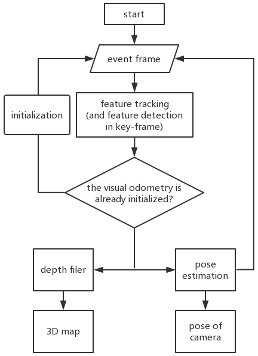

2019 IEEE ROBIO (Oral)

<b>Dekai Zhu</b>, Zhongcong Xu, Jinhu Dong, Canbo Ye, Prof. Guang Chen, et al.   
Tongji University 

 
The neuromorphic camera is a brand new vision sensor that has emerged in recent years. In contrast to the conventional frame-based camera, the neuromorphic camera only transmits local pixel-level changes at the time of its occurrence and provides an asynchronous event stream with low latency. It has the advantages of extremely low signal delay, low transmission bandwidth requirements, rich information of edges, high dynamic range etc., which make it a promising sensor in the application of in-vehicle visual odometry system. This paper proposes a neuromorphic in-vehicle visual odometry system using feature tracking algorithm. To the best of our knowledge, this is the first in-vehicle visual odometry system that only uses a neuromorphic camera, and its performance test is carried out on actual driving datasets. In addition, an in-depth analysis of the results of the experiment is provided. The work of this paper verifies the feasibility of in-vehicle visual odometry system using neuromorphic cameras.

[[paper](https://ieeexplore.ieee.org/document/8961878)]