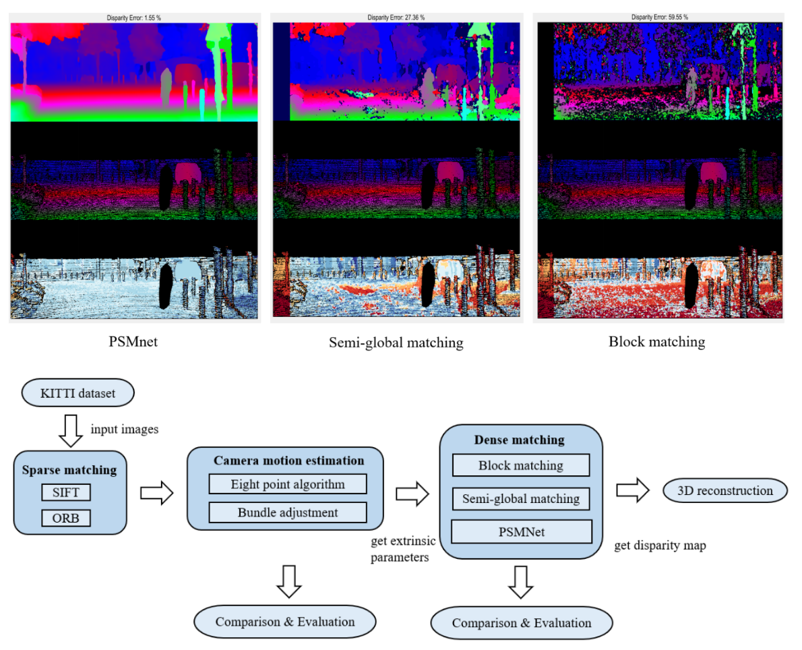

Project in the lecture "3D Scanning & Motion Capture (IN2354)", 2021

<b>Dekai Zhu</b>, Dongyue Lu, Qianyi Yang, Weihua Huang   
Supervisor: Yuchen Rao, Prof. Angela Dai   
Technical University of Munich

  <a href="http://dylanorange.github.io/files/3d.pdf">Project Report</a> | 
  <a href="https://github.com/Dekai21/Stereo_Reconstruction">Code</a>

  

 
In this project, we apply different stereo matching methods to reconstruct 3D scenes and compare their performance. Based on key-point detectors and eight-point algorithm, we recover the camera's extrinsic and rectify the images from left and right camera for the next step. Then we apply three dense matching methods to generate the disparity map respectively and further reconstruct the 3D scene. We evaluate the impact of different detectors and bundle adjustment on the accuracy of the estimated transformation. The experiment shows that SIFT performs better than ORB, and the accuracy of the estimated transform is also improved after using bundle adjustment. For dense matching, with PSMNet, which is the SOTA in disparity prediction, we can get much higher precision than classic methods block matching and semi-global matching.

