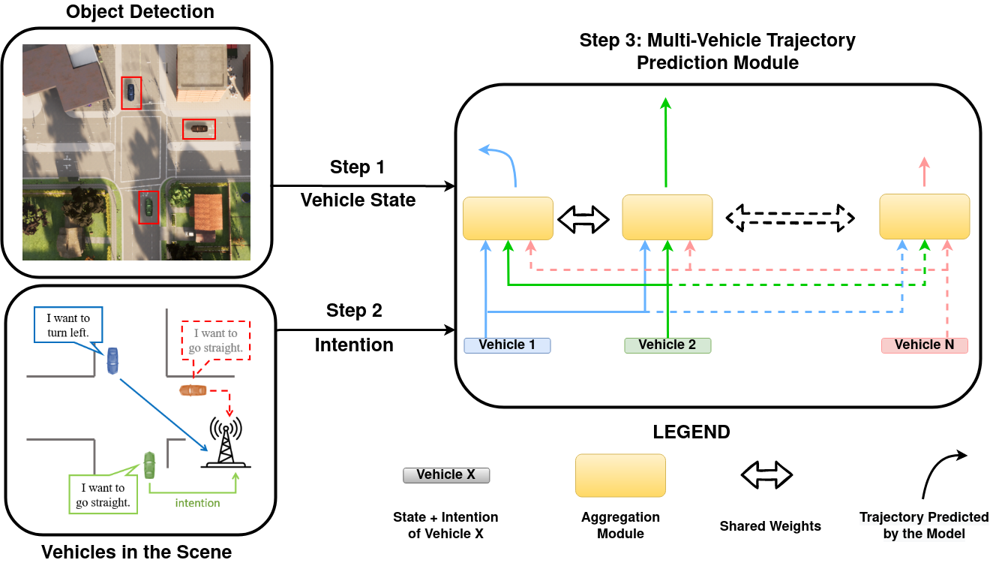

2022.1 - 2022.12 (Submitted, under review)

<b>Dekai Zhu*</b>, Qadeer Khan*, Prof. Daniel Cremers   
Technical University of Munich 

 
Traditional approaches to prediction of future trajectory of road agents rely on knowing information about their past trajectory. This work rather relies only on having knowledge of the current state and intended direction to make predictions for multiple vehicles at intersections. Furthermore, message passing of this information between the vehicles provides each one of them a more holistic overview of the environment allowing for a more informed prediction. This is done by training a neural network which takes the state and intent of the multiple vehicles to predict their future trajectory. Using the intention as an input allows our approach to be extended to additionally control the multiple vehicles to drive towards desired paths. Experimental results demonstrate the robustness of our approach both in terms of trajectory prediction and vehicle control at intersections.

[[video](https://github.com/Dekai21/Multi_Agent_Intersection/tree/master/videos)]
[[code](https://github.com/Dekai21/Multi_Agent_Intersection)]