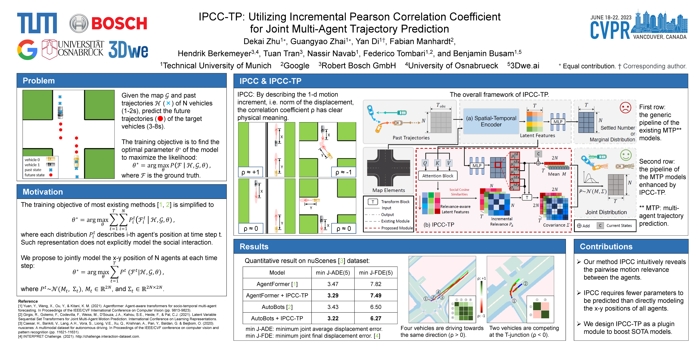

CVPR, 2023

<b>Dekai Zhu</b>, Guangyao Zhai, Yan Di, Fabian Manhardt, Hendrik Berkemeyer,   
Anh Tuan Tran, Nassir Navab, Federico Tombari, Benjamin Busam  
Technical University of Munich, Robert Bosch GmbH, Google

  <a href="https://openaccess.thecvf.com/content/CVPR2023/html/Zhu_IPCC-TP_Utilizing_Incremental_Pearson_Correlation_Coefficient_for_Joint_Multi-Agent_Trajectory_CVPR_2023_paper.html">Paper</a> | 
  <a href="https://cvpr.thecvf.com/virtual/2023/poster/22669">Poster</a>

  

 
Reliable multi-agent trajectory prediction is crucial for the safe planning and control of autonomous systems. Compared with single-agent cases, the major challenge in simultaneously processing multiple agents lies in modeling complex social interactions caused by various driving intentions and road conditions. Previous methods typically leverage graph-based message propagation or attention mechanism to encapsulate such interactions in the format of marginal probabilistic distributions. However, it is inherently sub-optimal. In this paper, we propose IPCC-TP, a novel relevance-aware module based on Incremental Pearson Correlation Coefficient to improve multi-agent interaction modeling. IPCC-TP learns pairwise joint Gaussian Distributions through the tightly-coupled estimation of the means and covariances according to interactive incremental movements. Our module can be conveniently embedded into existing multi-agent prediction methods to extend original motion distribution decoders. Extensive experiments on nuScenes and Argoverse 2 datasets demonstrate that IPCC-TP improves the performance of baselines by a large margin.

