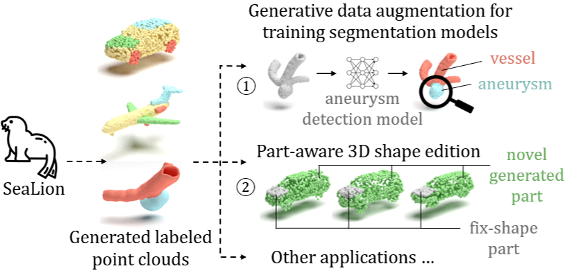

CVPR, 2025

Dekai Zhu1,2,3, Yan Di1, Stefan Gavranovic2, Slobodan Ilic1,2   
1 Technical University of Munich, 2 Siemens AG, 3 Munich Center for Machine Learning

 

<!-- 

  <a href="https://openaccess.thecvf.com/content/CVPR2023/html/Zhu_IPCC-TP_Utilizing_Incremental_Pearson_Correlation_Coefficient_for_Joint_Multi-Agent_Trajectory_CVPR_2023_paper.html">Paper</a> | 
  <a href="https://cvpr.thecvf.com/virtual/2023/poster/22669">Poster</a>

 -->

  

 
Denoising diffusion probabilistic models have achieved significant success in point cloud generation, enabling numerous downstream applications, such as generative data augmentation and 3D model editing. However, little attention has been given to generating point clouds with point-wise segmentation labels, as well as to developing evaluation metrics for this task. Therefore, in this paper, we present SeaLion, a novel diffusion model designed to generate high-quality and diverse point cloud with fine-grained segmentation labels. Specifically, we introduce the semantic part-aware latent point diffusion technique, which leverages the intermediate features of the generative models to jointly predict the noise for perturbed latent points and associated part segmentation labels during the denoising process, and subsequently decodes the latent points to point clouds conditioned on part segmentation labels. To effectively evaluate the quality of generated point clouds, we introduce a novel point cloud pairwise distance calculation method named part-aware Chamfer distance (p-CD). This method enables existing metrics, such as 1-NNA, to measure both the local structural quality and inter-part coherence of generated point clouds. Experiments on the large-scale synthetic dataset ShapeNet and real-world medical dataset IntrA, demonstrate that SeaLion achieves remarkable performance in generation quality and diversity, outperforming the existing state-of-the-art model, DiffFacto, by 13.33% and 6.52% on 1-NNA (p-CD) across the two datasets. Experimental analysis shows that SeaLion can be trained semi-supervised, thereby reducing the demand for labeling efforts. Lastly, we validate the applicability of SeaLion in generative data augmentation for training segmentation models and the capability of SeaLion to serve as a tool for part-aware 3D shape editing.

## Useful Links:
[Seals or Sea Lions – What’s the Difference?](https://lajollabythesea.com/seals-or-sea-lions-whats-the-difference/)